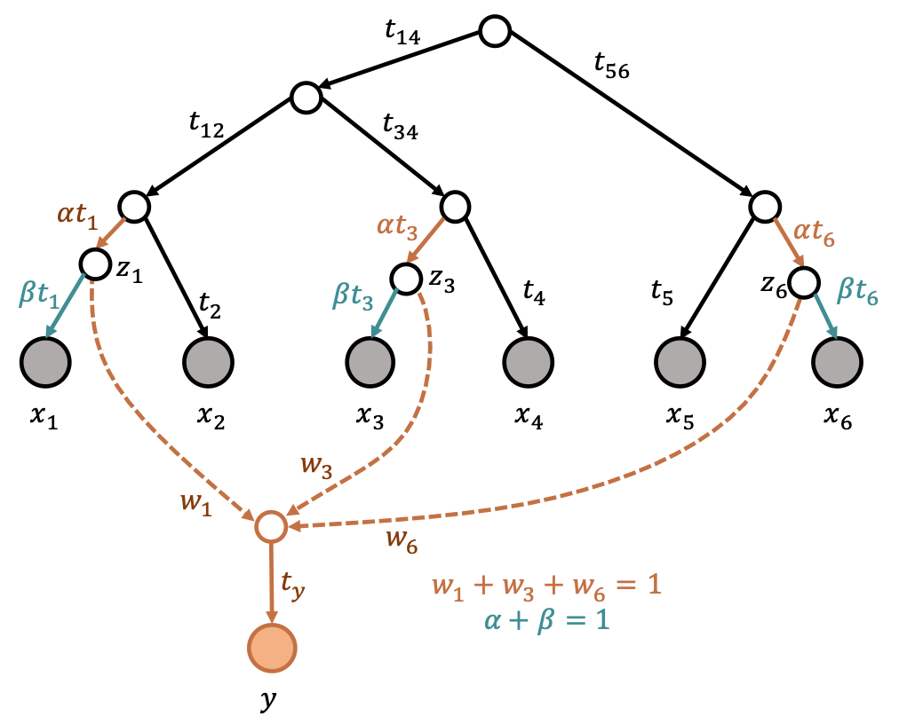

# migadmi

**mig**ration and **admi**xtures: method to estimate parameters in a complex admixture graph with multiple and nested admixture events

## Pipeline (running the test)

To demonstrate the test, please run `pipeline_wnd.py`

## Requirements

To run **migadmi** methods, you need Python 3.4 or later. A list of required Python packages that the migadmi depends on, are in `requirements.txt`.  

## Authors

Anna Igolkina developed the BernMix package, [e-mail](mailto:igolkinaanna11@gmail.com).    

## License information
The BernMix package is open-sourced software licensed under the [MIT license](https://opensource.org/licenses/MIT).

